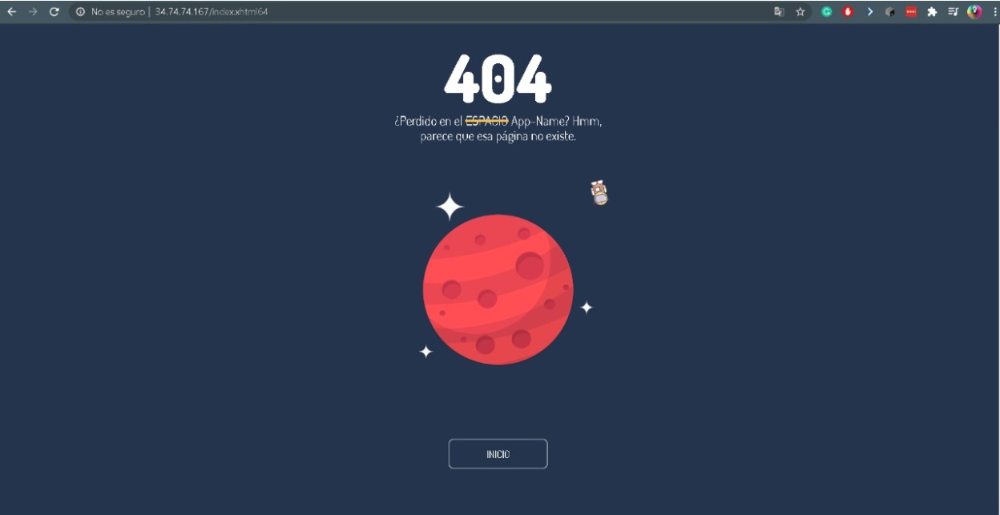

# Práctica de laboratorio 03 - EJB - JSF - JPA

# Versiones

                                                                                                     
                                                                                                    
 - Intellij idea ultimate 2020.01
 - Java=JavaSE-1.8
- GlassFish=5.0.1   

# Actividades

-   Implementar y diseñar un sistema empresarial para la facturación de una
    bodega usando JEE, JSF, EJB y JPA.

-   Desarrollar un sistema empresarial implementando Servicis Web.

-   Alojar un sistema empresarial en la nube con técnicas de integración
    continua.

# Diagrama Entidad-Relación

>   Captura de pantalla de un celular Descripción generada automáticamente

1.  Sección privada

-   Inicio de sesión con rol administrador

-   Ingresamos con el correo <evelynpintado23@gmail.com> que tiene asignado un
    rol 1 que en nuestra base de datos es el rol de administrador.

-   Perfil de casa de administrador

-   Gestión bodegas (inventario general)

-   Gestión productos (aumentar stock por bodega)

-   Gestión productos por bodega (inventario por bodega)

1.  Sección pública

-   De la misma forma para la sección pública obtenemos el correo de un empleado

>   <edwinFerML19@gmail.com> que tiene un código 2 en su rol en la base de
>   datos.

-   Pagina de Inicio para los vendedores

-   Gestión clientes

-   Gestión facturas (disminuir stock, anulación facturas, búsqueda de facturas)

-   Las siguientes imágenes muestran el funcionamiento de la facturación de la
    aplicación

-   Para realizar las facturas obtenemos tanto al cliente como el producto del
    que se va a realizar la factura con su respectiva forma de pago.

-   Y obtenemos una lista de facturas que ya han sido emitidas.

3.Seguridad

-   Sesiones

-   En cada una de las paginas se validaron el rol que tiene cada usuario para
    así permitirle o no realizar cierto tipo de cosas.

-   Reglas de navegación

Para las reglas de navegación tenemos el error con las paginas no encontradas
con el error 404 mientras que con el error 505 nos aseguramos de que la version
HTTP sea soportada por el servidor.

1.  Gestión Pedidos

-   Listar productos del catálogo organizado por categorías

-   Enviar la solicitud de un pedido a la distribuidora

-   Estados pedido clientes

-   Estados: Enviado, Receptado, En proceso, En camino, Finalizado

1.  Gestión cuentas clientes

-   Comprobación de que cada componente fue creado por separado

-   Iniciar Sesión

-   Registrar cuenta en base a la cédula

-   Modificar datos cuenta y cliente

-   Anular cuenta del cliente

-   Si el cliente no se encuentra registrado en la base de datos no podrá
    registrarse

-   Registró en base a la cédula

1.  Github Actions

a. Implementación del flujo de trabajo “Java CI with Maven”

1.  Microsoft Azure

b. Desplegar la solución en una instancia para que el sistema de distribuidora
UPS accesible desde un servidor alojado en la nube

1.  Jenkins

c. Configuración el servidor de CI para que exista un cambio en el repositorio
master de Github.

-   Implementación en el Github

-   Repositorios Utilizados:

<https://github.com/dguzmanc4/DistribuidoraJSF.git>

-   **Se ha implementado con éxito la practica EJB, JSF y JPA pero a pesar de
    eso se tuvieron problemas para el desarrollo completo y correcto de la
    practica Angular por el conocimiento base de la herramienta, lo que nos
    llevo a una investigación y retro alimentación para su implementación. El
    IDE utilizado para este proyecto resulto ser el adecuado, pero se tuvieron
    complicaciones con el servidor Glassfish lo que hiso que esta practica se
    tardará mas de lo esperado.**

-   **Para el desarrollo gráfico de la interfaz es mucho más sencillo utilizar
    plantillas, eso ahorrara tiempo; también cuando se desarrolle la aplicación
    en java con el servidor glassfish, es recomendable revisar todos los cambios
    que se van a realizar antes porque por el mínimo error, tendrá que volver a
    correr el servidor y esperar mas tiempo.**

**Nombre de estudiante:**

-   **Daniel Guzmán**

-   **Edwin Marquez**

-   **Evelyn Pintado Ch.**

-   **Christian Yunga**
